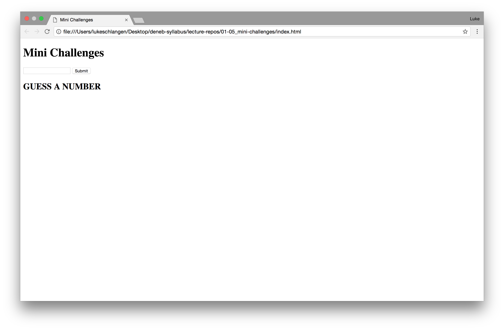
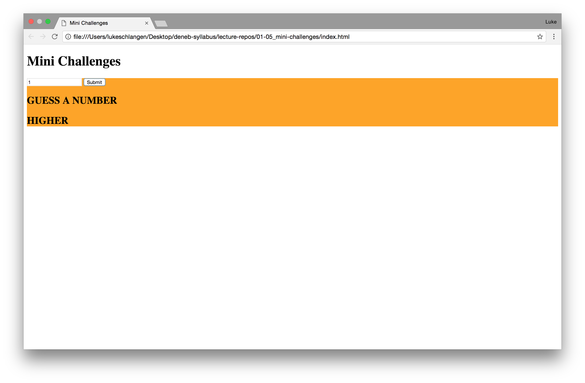
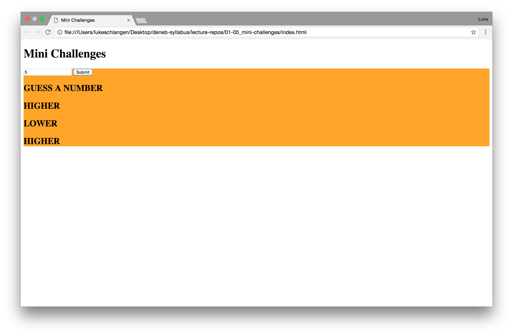
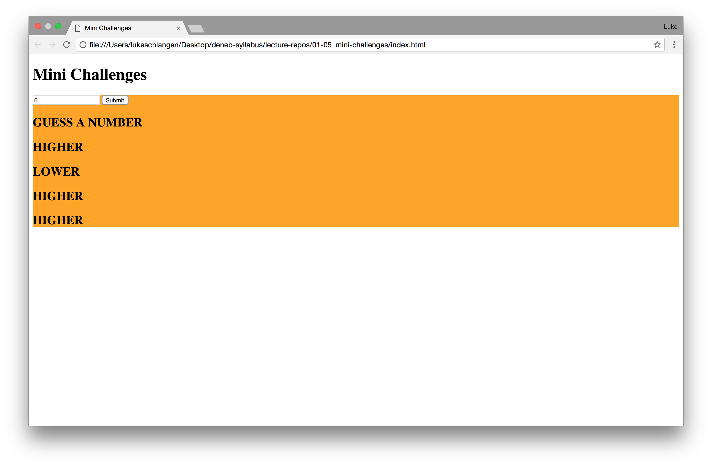
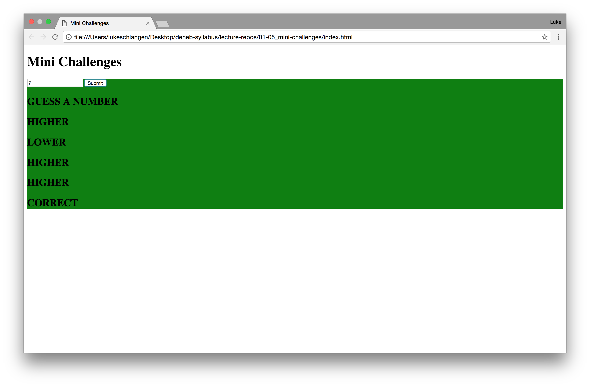

# jQuery Number Guess

## Small Steps!!!

Speed is not the goal of this project!

Start this project by breaking it into small steps. It's a very large project that will require a lot of logic and jQuery. Make a small change, then test, make another small change, then test.

## Description

Create an imput box for someone to submit a guess between 1-10 (no decimals).
Allow the user to click `Submit`. That should chck if they are correct.
If they are correct, print `Correct` on the screen and change the background color to green.
If they are not correct, print `Higher` or `Lower` to the screen. If the number is `Higher` than the user's guess, the background should turn orange. If the number is `Lower` than the user's guess, the background should turn yellow.

## Demo

This is just one possible solution. So if your solution doesn't look exactly like this, don't worry about it.

## Hard Mode

The fun don't stop! If they have guessed correctly, add a `New Game` Button to the page and start the process over!

Don't forget... *small steps!!!*